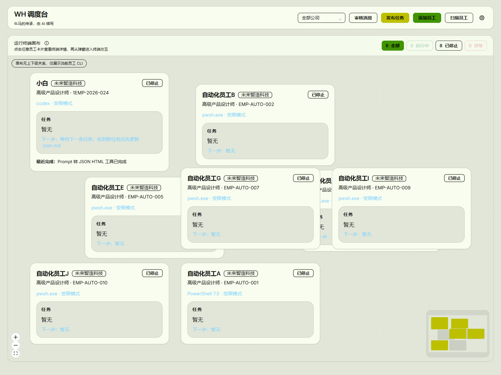
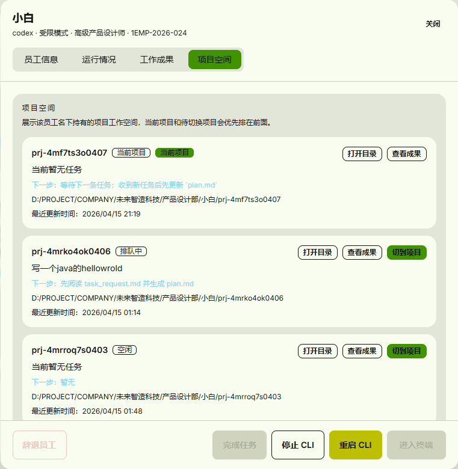
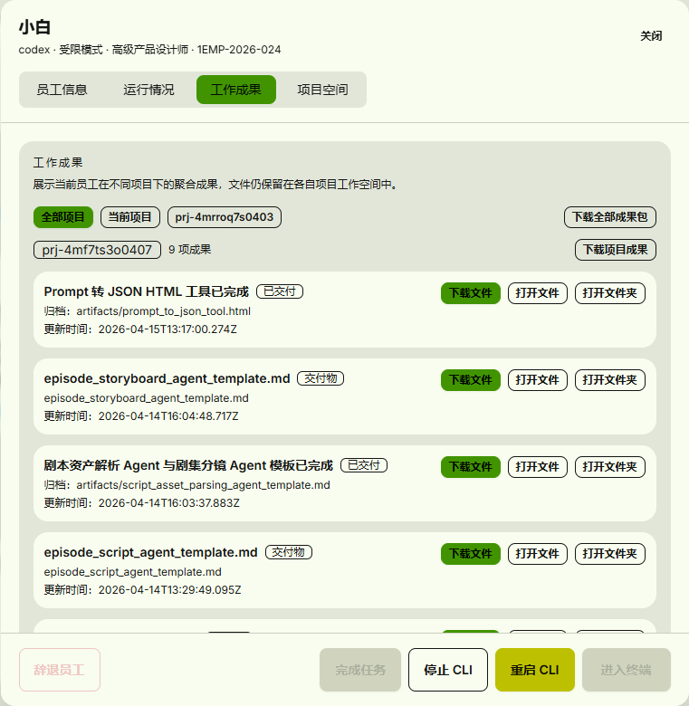
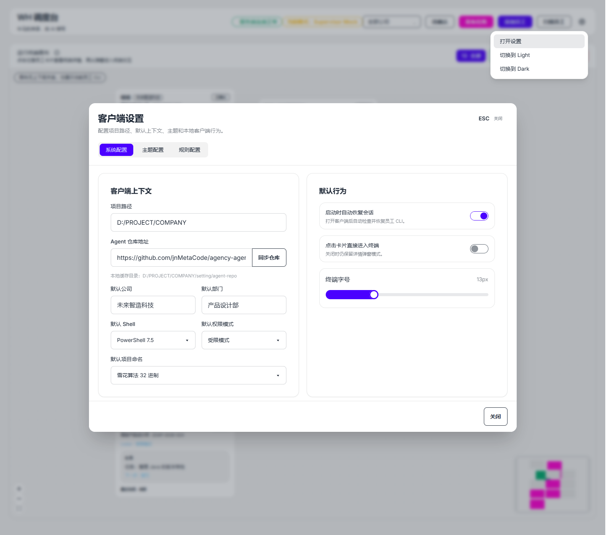

# C-CLIENT

`C-CLIENT` 是员工 CLI Agent 的本地运行时宿主。

它不是业务决策中心。客户端负责：

- 基于公司、部门、成员、任务上下文初始化本地运行目录和任务空间
- 启动、停止、恢复员工 CLI 运行时
- 监控运行时健康度、Agent 身份、当前激活任务
- 对 UI 暴露统一的本地命令 / 事件接口
- 为后续服务端 WebSocket 通信复用同一套命令 / 事件模型

它不负责：

- CEO 到 leader 到员工的任务规划和逐级分发
- 组织与任务主数据的最终真相源
- 最终分配决策和全局调度

## 界面预览

### 总览画布



### 项目空间视图



### 工作成果聚合



### 系统设置



## 当前平台支持

- Windows：主支持平台
- Linux：理论可运行，待系统验收
- macOS：理论可运行，待系统验收
- iOS / Android：当前架构不支持

## 当前安全能力

- 支持可选开启的本地 API Key 鉴权
- 覆盖本地 REST 接口与 `/terminal` WebSocket
- 配置保存到 `{项目路径}/setting/security.json`

## 当前 Codex 能力

- 首次启动会自动进入引导流程
- 引导顺序：
  - 配置 Codex
  - 创建第一个员工
  - 发布第一条任务
- 设置页已提供独立的 `Codex 配置` tab
- 支持表单方式编辑以下配置：
  - `config.toml`
  - `auth.json`
- 表单配置现已覆盖：
  - 模型与提供方
  - 推理强度与网络访问
  - 审批策略与沙箱模式
  - Windows 沙箱兼容项
- 默认写入位置：
  - `{CODEX_HOME}/config.toml`
  - `{CODEX_HOME}/auth.json`
  - 未设置 `CODEX_HOME` 时默认使用 `~/.codex`
- 支持连通性测试
- 支持 `config.toml` 源文件开发者编辑模式
- 项目空间现在采用：
  - 员工根目录保留 `EMPLOYEE_AGENT.md`
  - 项目空间按员工级开关生成 `AGENTS.md`
- `EMPLOYEE_AGENT.md` 作为员工模板唯一真相源
- 启用系统增强时：
  - 从员工根目录的 `EMPLOYEE_AGENT.md` 覆写到项目空间 `AGENTS.md`
- 关闭系统增强时：
  - 删除项目空间 `AGENTS.md`
- 已通过真实 `codex exec` 验证项目空间内的 `AGENTS.md` 会生效

## 当前目录模型

当前客户端已经开始从“一个员工对应一个项目空间”过渡到“两层模型”：

1. 员工根目录
  - 保存员工画像、`EMPLOYEE_AGENT.md`、`projects.json`、`deliveries-index.json`
2. 项目工作空间
  - 保存某个具体项目的 `AGENTS.md / task_request.md / runtime/meta.json / references/ / artifacts/`

这样做的目标是：

- 让不同项目上下文天然隔离
- 让工作成果在员工层聚合展示
- 为“当前项目完成后自动切到下一个项目”铺路
- 让 Codex 在进入项目空间时自动加载长期规则
- 让任务可附带文件、图片等参考资料

## 当前文档

- [MVP 当前版本说明](./docs/mvp-current-state.md)
- [本地 REST / WebSocket API](./docs/local-api-reference.md)
- [Docker / Podman 运行说明](./docs/docker-podman.md)
- [客户端运行时架构](./docs/client-runtime-architecture.md)
- [员工 Codex 运行时设计](./docs/employee-codex-runtime.md)
- [观察者 Inspector 设计稿](./docs/inspector-scheduler.md)
- [运行时协议](./docs/runtime-protocol.md)
- [UI 风格规范](./docs/ui-style-guide.md)

## 第一阶段目标

第一阶段先聚焦在一个可长期运行的本地 Supervisor：

1. UI 和运行时监督进程分离
2. 使用事件日志 + 状态快照，而不是 SQLite
3. 一个员工运行时从一个激活中的任务上下文恢复
4. 服务端轮询快照，并在重连后按事件增量补拉
5. 客户端只主动推送关键状态变化事件

## 本地运行

先安装依赖：

```bash
npm install
```

同时启动 UI 和本地 PTY bridge：

```bash
npm run dev:all
```

如果只想单独启动 bridge：

```bash
npm run bridge
```

默认端口：

- UI: `http://127.0.0.1:4273`
- PTY bridge: `http://127.0.0.1:4281`

首次启动建议：

1. 先完成 Codex 配置和连通性测试
2. 再创建第一个员工
3. 最后发布第一条任务验证完整链路

## 环境变量

项目现在支持根目录 `.env` 配置。

推荐做法：

```bash
cp .env.example .env
```

说明：

- Vite 会自动读取 `.env` 中的 `VITE_*` 变量
- `bridge/server.mjs` 与 `bridge/container-entry.mjs` 现在也会自动读取根目录 `.env`
- 本地开发最常用的是：
  - `CCLIENT_BRIDGE_HOST`
  - `CCLIENT_BRIDGE_PORT`
  - `VITE_DEFAULT_PROJECT_PATH`
  - `VITE_BRIDGE_HOST`
  - `VITE_BRIDGE_PORT`
- 线上如果要让外部浏览器访问 bridge，通常需要：
  - `CCLIENT_BRIDGE_HOST=0.0.0.0`

`.env.example` 已包含默认示例和注释：

- [`.env.example`](./.env.example)

## 容器运行

已提供：

- `Dockerfile`
- `.dockerignore`
- `docker-compose.yml`
- [Docker / Podman 运行说明](./docs/docker-podman.md)

当前容器部署已支持运行时前端配置：

- bridge 地址可以在 `docker run` / `docker compose` 启动时通过环境变量覆盖
- 不再要求为了改 bridge 地址重新构建镜像
- 具体配置项与含义见：
  - [Docker / Podman 运行说明](./docs/docker-podman.md)
